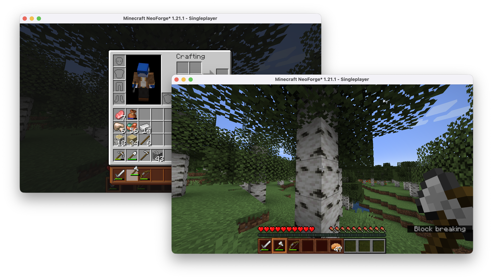

# Satchels

Satchels is a Minecraft mod that adds the Satchel, a new inventory management tool.
The Satchel gives you 6 extra inventory slots, which can be swapped out on-demand with your hotbar.
This gives you much more space for tools and blocks, and can be quite useful when building or engineering :)
